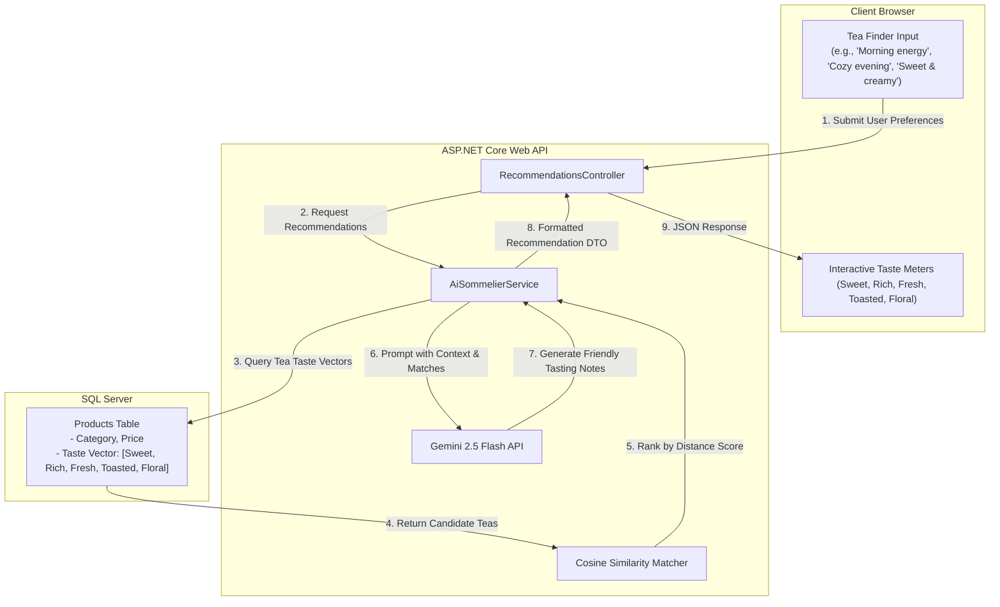
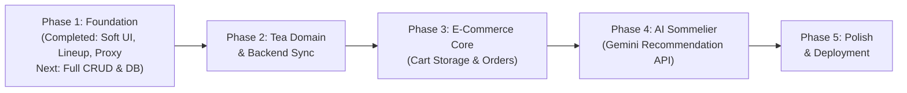

# Lumen: Tea & Matcha E-Commerce Architecture & Project Plan

---

## 1. Executive Summary & Vision

**Lumen** is a specialized e-commerce platform dedicated to fresh, accessible, and high-grade teas — featuring ceremonial matcha, roasted hojicha, genmaicha, sencha, black tea, and milk tea blends. While the primary long-term differentiator is an **AI-powered Tea Finder & Sommelier** providing personalized recommendations matched to customer taste preferences, the initial focus is establishing a clean, friendly, and robust **CRUD e-commerce foundation**.

This plan provides:
1. An exhaustive breakdown of the codebase and modern tech stack (.NET 10 + React 19 + EF Core + Bootstrap Icons).
2. Explanations of what every file and component does and how data travels across boundaries.
3. Current project status, completed milestones, and architecture critiques.
4. The future architecture and AI integration blueprint.
5. Strategic recommendations, learning guidance, and a phased execution timeline.

---

## 2. Current Architecture & Tech Stack

### 2.1 Backend Stack (.NET 10 Web API)
* **Framework**: ASP.NET Core Web API on **.NET 10 (v10.0.401)**.
* **Language**: C# 13/14 utilizing modern syntax (primary constructors, file-scoped namespaces, collection expressions, implicit usings).
* **Data Access / ORM**: Entity Framework Core 10 (`Microsoft.EntityFrameworkCore.SqlServer`, `Microsoft.EntityFrameworkCore.Design`).
* **API Documentation**: Microsoft OpenAPI tooling (`Microsoft.AspNetCore.OpenApi`) with development-time OpenAPI endpoint (`/openapi/v1.json`).
* **Web Server**: Kestrel with configurable CORS allowing frontend dev origin (`http://localhost:5173`).
* **Runtime Port**: Configured to run at `http://localhost:5008`.

### 2.2 Frontend Stack (React 19 + Vite)
* **Library**: React 19 (`react` 19.2.8, `react-dom` 19.2.8).
* **Build Tool & Dev Server**: Vite 8 (`vite` 8.3.0, `@vitejs/plugin-react` 6.1.1) with backend proxying `/api` -> `http://localhost:5008`.
* **Language & Type Checking**: TypeScript 6 (`typescript` ~6.0.2, target `ES2023`, `moduleResolution: bundler`).
* **Iconography**: Bootstrap Icons (`bootstrap-icons` 1.13.x, zero emojis, clean SVG/webfont integration).
* **Linter**: Oxlint 1.81.0 (fast Rust-based linter).
* **Design Philosophy**: Soft, calm, and beginner-friendly aesthetic using a light pine-jade green accent (`#3d6f5c`, soft tint `#eaf3ee`, border `#d4e5dc`), warm ivory surfaces (`#fbfaf7`), rounded pill controls, and comfortable typography.

### 2.3 Database & Infrastructure
* **Target Database**: Microsoft SQL Server.
* **Connection String**: Configured in [`server/appsettings.json`](file:///Users/alicia/webProjects/Lumen/server/appsettings.json) targeting `Server=localhost,1433;Database=Lumen;User Id=sa;...`.
* **Platform Context**: Developed on macOS (where SQL Server requires Docker / Azure SQL Edge container execution).

---

## 3. Current File Structure & What Each File Does

```
Lumen/
├── Lumen.slnx                         # Solution file for .NET projects (modern XML format)
├── README.md                          # Project introduction and quick-start notes
├── ProjectPlan.md                     # Comprehensive architecture and roadmap (this document)
├── .gitignore                         # Git exclusion rules for node_modules, bin, obj, etc.
│
├── server/                            # ASP.NET Core Web API backend
│   ├── Lumen.Api.csproj               # Project manifest: packages, target framework, settings
│   ├── Lumen.Api.http                 # In-editor HTTP request scratchpad for testing endpoints
│   ├── Program.cs                     # API entry point: DI, middleware, pipeline configuration
│   ├── appsettings.json               # Base configuration (SQL Server connection string, log levels)
│   ├── appsettings.Development.json   # Development-specific environment overrides
│   ├── Controllers/
│   │   └── ProductsController.cs      # HTTP endpoint handler for product operations
│   ├── Data/
│   │   └── AppDbContext.cs            # EF Core database context and entity schema configurations
│   ├── Models/
│   │   └── Product.cs                 # Domain entity model representing a product in the catalog
│   └── Properties/
│       └── launchSettings.json        # Local runtime launch profiles (HTTP port 5008)
│
└── client/                            # React + Vite frontend
    ├── package.json                   # NPM dependencies (React 19, Bootstrap Icons, Vite)
    ├── package-lock.json              # Deterministic NPM dependency lockfile
    ├── vite.config.ts                 # Bundler config + reverse proxy for /api -> localhost:5008
    ├── tsconfig.json                  # TypeScript project references root
    ├── tsconfig.app.json              # TypeScript configuration for frontend application code
    ├── tsconfig.node.json             # TypeScript configuration for Node-based tools
    ├── index.html                     # Single-page application HTML entry shell
    ├── public/
    │   ├── favicon.svg                # Browser tab icon
    │   └── icons.svg                  # SVG sprite sheet
    └── src/
        ├── main.tsx                   # React root mount with Bootstrap Icons stylesheet
        ├── App.tsx                    # Root component orchestrating catalog, filters, modal, and cart
        ├── App.css                    # Soft pine-jade design system and component styling
        ├── index.css                  # Global design tokens, palette variables, and reset
        ├── types/
        │   └── product.ts             # TypeScript definitions for Product, TeaCategory, FlavorProfile, BrewingGuide, CartItem
        ├── data/
        │   └── mockProducts.ts        # Beginner-friendly tea lineup: Matcha, Hojicha, Genmaicha, Sencha, Black, Milk Tea
        ├── services/
        │   └── api.ts                 # API service connecting to /api/products with automatic offline fallback
        ├── components/
        │   ├── Header.tsx             # Friendly navigation, announcement banner, brand lockup, cart badge
        │   ├── Hero.tsx               # Welcoming header, action buttons, and clear tea benefits
        │   ├── FlavorFilter.tsx       # Category pills, search bar, taste note filters, and sort options
        │   ├── ProductCard.tsx        # Tea card with category pill, caffeine level, price, and actions
        │   ├── ProductModal.tsx       # Product detail modal with clear brewing steps and taste meters
        │   ├── CartDrawer.tsx         # Slide-out cart with shipping threshold tracker and quantity controls
        │   ├── AiSommelierBanner.tsx  # AI Tea Finder preview with mood-based recommendations
        │   └── Footer.tsx             # Brand overview, category navigation, newsletter input, and credits
        └── assets/                    # Image and logo assets
```

### Detailed File Responsibilities

| File Path | Role & How It Works |
| :--- | :--- |
| [`Lumen.slnx`](file:///Users/alicia/webProjects/Lumen/Lumen.slnx) | Modern solution file (.NET 9+) tracking project references and coordinating builds. |
| [`server/Program.cs`](file:///Users/alicia/webProjects/Lumen/server/Program.cs) | **Backend entry point**. Configures dependency injection (`AddControllers`, `AddDbContext`, `AddCors`, `AddOpenApi`), HTTP middleware pipeline, and port mapping. |
| [`server/Data/AppDbContext.cs`](file:///Users/alicia/webProjects/Lumen/server/Data/AppDbContext.cs) | Bridges C# and SQL Server. Maps the `Product` entity with column constraints (`MaxLength`, decimal precision, default UTC timestamp). |
| [`server/Models/Product.cs`](file:///Users/alicia/webProjects/Lumen/server/Models/Product.cs) | The C# class representing a tea item in the database. |
| [`server/Controllers/ProductsController.cs`](file:///Users/alicia/webProjects/Lumen/server/Controllers/ProductsController.cs) | Handles HTTP requests for products (`GetAll`, `GetById`, `Create`). |
| [`client/vite.config.ts`](file:///Users/alicia/webProjects/Lumen/client/vite.config.ts) | Vite bundler configuration equipped with a reverse proxy forwarding `/api` calls to `http://localhost:5008`. |
| [`client/src/App.tsx`](file:///Users/alicia/webProjects/Lumen/client/src/App.tsx) | Central application coordinator managing product data, category filters, search query, taste tags, cart state, modal views, and API synchronization. |
| [`client/src/types/product.ts`](file:///Users/alicia/webProjects/Lumen/client/src/types/product.ts) | Defines structured TypeScript models for `Product`, `TeaCategory`, `FlavorProfile`, `BrewingGuide`, and `CartItem`. |
| [`client/src/data/mockProducts.ts`](file:///Users/alicia/webProjects/Lumen/client/src/data/mockProducts.ts) | Comprehensive starter catalog featuring Hojicha, Matcha, Genmaicha, Sencha, Black Tea, and Milk Tea with plain-language descriptions. |
| [`client/src/services/api.ts`](file:///Users/alicia/webProjects/Lumen/client/src/services/api.ts) | Clean network client querying `/api/products` and falling back smoothly to starter teas when the local database is offline. |

---

## 4. End-to-End Execution & Data Flow

```mermaid
sequenceDiagram
    autonumber
    actor Customer as Customer / Browser
    participant React as React 19 Frontend (Vite)
    participant Proxy as Vite Dev Proxy (/api)
    participant API as ASP.NET Core Web API (Kestrel :5008)
    participant Controller as ProductsController
    participant EF as EF Core (AppDbContext)
    participant DB as SQL Server Database

    Customer->>React: Visits Storefront (Filters by "Hojicha")
    React->>Proxy: Fetch GET /api/products
    alt Backend API is Online
        Proxy->>API: HTTP GET http://localhost:5008/api/products
        API->>Controller: Route matches ProductsController.GetAll()
        Controller->>EF: dbContext.Products.AsNoTracking().ToListAsync()
        EF->>DB: Query SQL: SELECT [Id], [Name], [Price]... FROM [Products]
        DB-->>EF: Tabular Rows
        EF-->>Controller: List<Product> Entities
        Controller-->>API: 200 OK JSON
        API-->>Proxy-->>React: Live Products Data
    else Backend API is Offline
        React->>React: Catch network timeout -> Render curated starter catalog (mockProducts.ts)
    end
    React->>Customer: Renders soft pine-jade tea cards with active filters
```

---

## 5. Architectural Status & Critiques

### 5.1 Completed & Resolved Areas
* **Soft & Friendly Frontend**: The default Vite demo screen has been replaced with a complete storefront designed in a calm, light pine-jade green theme (`#3d6f5c`).
* **Expanded Lineup with Hojicha**: The tea catalog prominently includes Hojicha alongside Matcha, Genmaicha, Sencha, Black Tea, and Milk Tea with friendly descriptions.
* **Iconography & Polish**: Removed all emojis; integrated Bootstrap Icons cleanly.
* **No Trailing-Dot Design**: Eliminated decorative dot prefixes across headings, buttons, and navigation.
* **Vite Reverse Proxy**: Configured `/api` proxying to `http://localhost:5008` in `client/vite.config.ts`, eliminating browser CORS issues in development.

### 5.2 Areas Requiring Next Development
1. **Incomplete Backend CRUD Operations**:
   - `ProductsController.cs` currently implements `GetAll`, `GetById`, and `Create`. Missing `Update (PUT /api/products/{id})` and `Delete (DELETE /api/products/{id})`.
2. **Backend Domain Synchronization**:
   - The backend `Product.cs` model has simple generic fields (`Name`, `Slug`, `Description`, `Price`, `ImageUrl`). It needs to be updated to match the rich tea domain (`Category`, `CaffeineLevel`, `TasteProfile`, `BrewingGuide`, `StockQuantity`).
3. **Database Migrations Not Yet Created**:
   - `Microsoft.EntityFrameworkCore.Design` is installed, but no initial migration exists. When connecting to SQL Server, the schema must be generated via `dotnet ef migrations add InitialCreate`.
4. **macOS SQL Server Containerization**:
   - To run SQL Server seamlessly on Apple Silicon macOS, a `docker-compose.yml` file is needed, or a dual SQLite fallback toggle should be added to `Program.cs`.

---

## 6. Future Tech Stack & Architecture Evolution

### 6.1 Backend Architecture
```
server/
├── Controllers/              # Thin HTTP endpoints (ProductsController, RecommendationsController)
├── DTOs/                     # Data Transfer Objects (ProductUpsertDto, ProductResponseDto)
├── Services/                 # Business logic interfaces & services
│   ├── IProductService.cs    # Product domain service
│   ├── ICartService.cs       # Session & cart calculations
│   └── IAiSommelierService.cs# Vector similarity & Gemini prompt orchestration
├── Data/
│   ├── AppDbContext.cs       # Entity mapping & schema constraints
│   ├── Migrations/           # Versioned schema migrations
│   └── Seed/                 # Artisan tea database seeder
└── Infrastructure/
    └── Ai/                   # Semantic search & LLM recommendation client
```

### 6.2 Frontend Architecture
* **State Management**: As cart and filter complexity grows, migrate state from `App.tsx` into a lightweight Zustand store.
* **Persistent Cart**: Sync cart items with `localStorage` so items survive page reloads.
* **Interactive AI Quiz**: Expand the "AI Tea Finder" into a multi-step guided quiz (time of day, preferred sweetness, hot vs iced, caffeine tolerance).

---

## 7. AI Integration Blueprint: The Personal Tea Finder



---

## 8. Strategic Approach & Recommendations

### 8.1 Recommended Developer Workflow on macOS
1. **Provide a `docker-compose.yml`**:
   Spin up SQL Server on macOS in a container (`docker compose up -d`).
2. **Dual SQLite Fallback**:
   Support SQLite in `appsettings.Development.json` for lightweight local development without needing Docker running continuously.

### 8.2 Learning Milestones for .NET 10 & React 19
* **In .NET 10**:
  - Understand Dependency Injection and Primary Constructors in `ProductsController(AppDbContext dbContext)`.
  - Learn EF Core migrations: `dotnet ef migrations add <Name>` and `dotnet ef database update`.
  - Master DTO patterns to protect domain models from over-posting.
* **In React 19**:
  - Master component composition and state management.
  - Learn data fetching patterns with modern hooks and fallback states.
  - Handle smooth UI transitions and modal accessibility.

---

## 9. Phased Execution Roadmap & Timeline



### Phase 1: Environment Setup & Full CRUD Baseline (Current)
* **Frontend (Completed)**:
  - Soft pine-jade green storefront layout with comfortable typography and spacing.
  - Tea lineup expanded with Hojicha, Genmaicha, Sencha, Black Tea, Milk Tea, and Matcha.
  - Integrated Bootstrap Icons and removed emojis.
  - Configured Vite reverse proxy (`/api` -> `http://localhost:5008`).
* **Backend (Next Steps)**:
  - Add missing endpoints: `PUT /api/products/{id}` and `DELETE /api/products/{id}` in `ProductsController.cs`.
  - Configure `docker-compose.yml` for SQL Server.
  - Run initial EF Core migration (`InitialCreate`).

### Phase 2: Domain Synchronization & Rich Catalog (Sprint 2)
* **Backend**:
  - Update `Product.cs` to include `Category`, `CaffeineLevel`, `TasteProfile`, `BrewingGuide`, and `StockQuantity`.
  - Introduce DTOs (`ProductUpsertDto`, `ProductResponseDto`).
  - Create database seeder populating authentic tea profiles.
* **Frontend**:
  - Add admin/management modal or form to test creating, updating, and deleting teas live through the API.

### Phase 3: Persistent Cart & Order Management (Sprint 3)
* **Frontend**:
  - Add `localStorage` persistence for `cartItems`.
  - Build checkout form capturing customer shipping info.
* **Backend**:
  - Create `Order` and `OrderItem` models in EF Core.
  - Implement `POST /api/orders` endpoint.

### Phase 4: AI Recommendation Integration (Sprint 4)
* **Backend**:
  - Implement `RecommendationsController` and `AiSommelierService`.
  - Integrate Gemini Flash API to generate personalized tasting notes and pairings.
* **Frontend**:
  - Expand the AI Tea Finder into a multi-step preference wizard.

### Phase 5: Testing, Hardening & Deployment (Sprint 5)
* Unit tests with xUnit and Vitest.
* Multi-stage Docker build for backend and frontend.

---

## 10. Summary Checklist of Next Immediate Actions

- [x] Configure Vite reverse proxy in `client/vite.config.ts`.
- [x] Build soft, calm storefront layout with tea catalog, modal, and cart drawer.
- [x] Integrate Bootstrap Icons and eliminate all emojis.
- [x] Support core tea lineup including Hojicha, Matcha, Genmaicha, Sencha, Black Tea, and Milk Tea.
- [ ] Implement `PUT` and `DELETE` endpoints in `server/Controllers/ProductsController.cs`.
- [ ] Update backend `Product.cs` model to match the tea domain.
- [ ] Provide `docker-compose.yml` (and/or SQLite toggle) for local database execution on macOS.
- [ ] Generate initial EF Core migration (`dotnet ef migrations add InitialCreate`).
