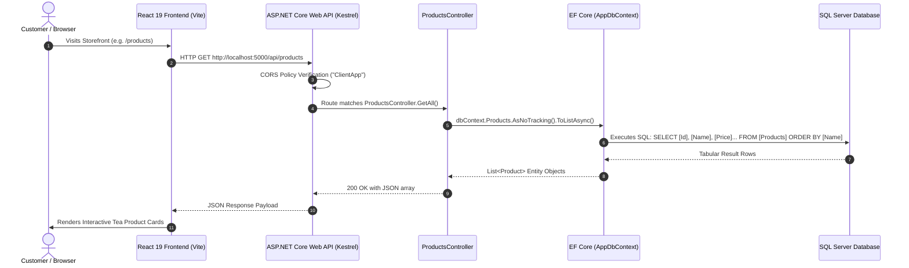
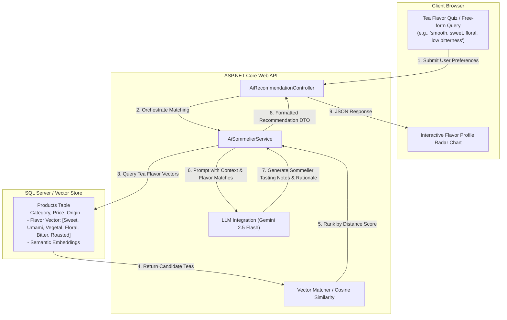
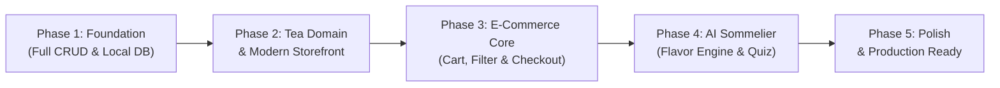

# Lumen: Tea & Matcha E-Commerce Architecture & Project Plan

---

## 1. Executive Summary & Vision

**Lumen** is a specialized e-commerce platform dedicated to premium teas, single-origin matchas, and artisanal brewing essentials. While the ultimate differentiator is an **AI-powered Tea Sommelier** providing personalized recommendations based on nuanced flavor profiles (e.g., umami, grassy, floral, astringent, nutty, sweet, roasted), the immediate objective is building a clean, robust, and idiomatic **CRUD e-commerce foundation**.

This plan provides:
1. An exhaustive breakdown of the current codebase and tech stack (.NET 10 + React 19 + EF Core).
2. Explanations of what every file and folder does and how data travels across the boundaries.
3. Frank architectural critiques and gaps that need to be resolved.
4. The future architecture and AI integration blueprint.
5. Strategic recommendations, learning guidance, and a phased execution timeline.

---

## 2. Current Architecture & Tech Stack

### 2.1 Backend Stack (.NET 10 Web API)
* **Framework**: ASP.NET Core Web API on **.NET 10 (v10.0.401)**.
* **Language**: C# 13/14 utilizing modern syntax (primary constructors, file-scoped namespaces, collection expressions, implicit usings).
* **Data Access / ORM**: Entity Framework Core 10 (`Microsoft.EntityFrameworkCore.SqlServer`, `Microsoft.EntityFrameworkCore.Design`).
* **API Documentation**: Microsoft OpenAPI tooling (`Microsoft.AspNetCore.OpenApi`) with development-time OpenAPI endpoint (`/openapi/v1.json`).
* **Web Server**: Kestrel with configurable CORS allowing frontend dev origin (`http://localhost:5173`).

### 2.2 Frontend Stack (React 19 + Vite)
* **Library**: React 19 (`react` 19.2.8, `react-dom` 19.2.8).
* **Build Tool & Dev Server**: Vite 8 (`vite` 8.3.0, `@vitejs/plugin-react` 6.1.1).
* **Language & Type Checking**: TypeScript 6 (`typescript` ~6.0.2, target `ES2023`, `moduleResolution: bundler`).
* **Linter**: Oxlint 1.81.0 (ultra-fast Rust-based JavaScript/TypeScript linter).
* **Styling**: Standard CSS boilerplate (`App.css`, `index.css`).

### 2.3 Database & Infrastructure
* **Target Database**: Microsoft SQL Server.
* **Connection String**: Configured in [`server/appsettings.json`](file:///Users/alicia/webProjects/Lumen/server/appsettings.json) targeting `Server=localhost,1433;Database=Lumen;User Id=sa;...`.
* **Platform Context**: Developed on macOS (where SQL Server requires Docker / Azure SQL Edge container execution).

---

## 3. Current File Structure & What Each File Does

```
Lumen/
├── Lumen.slnx                         # Solution file for .NET projects (modern XML format)
├── README.md                          # Project introduction and quick-start notes
├── .gitignore                         # Git exclusion rules for node_modules, bin, obj, etc.
│
├── server/                            # ASP.NET Core Web API backend
│   ├── Lumen.Api.csproj               # Project manifest: packages, target framework, settings
│   ├── Lumen.Api.http                 # In-editor HTTP request scratchpad for testing endpoints
│   ├── Program.cs                     # API entry point: DI, middleware, pipeline configuration
│   ├── appsettings.json               # Base configuration (SQL Server connection string, log levels)
│   ├── appsettings.Development.json   # Development-specific environment overrides
│   ├── Controllers/
│   │   └── ProductsController.cs      # HTTP endpoint handler for product operations
│   ├── Data/
│   │   └── AppDbContext.cs            # EF Core database context and entity schema configurations
│   ├── Models/
│   │   └── Product.cs                 # Domain entity model representing a product in the catalog
│   └── Properties/
│       └── launchSettings.json        # Local runtime launch profiles (ports, HTTP/HTTPS URLs)
│
└── client/                            # React + Vite frontend
    ├── package.json                   # NPM dependencies, scripts, and package metadata
    ├── package-lock.json              # Deterministic NPM dependency lockfile
    ├── vite.config.ts                 # Vite bundler plugins and build configuration
    ├── tsconfig.json                  # TypeScript project references root
    ├── tsconfig.app.json              # TypeScript configuration for frontend application code
    ├── tsconfig.node.json             # TypeScript configuration for Node-based tools (Vite config)
    ├── index.html                     # Single-page application HTML entry shell
    ├── public/
    │   ├── favicon.svg                # Browser tab icon
    │   └── icons.svg                  # SVG sprite sheet for icon assets
    └── src/
        ├── main.tsx                   # React root entry point: mounts App component into DOM
        ├── App.tsx                    # Root React component (currently Vite starter template)
        ├── App.css                    # Component styles for App.tsx
        ├── index.css                  # Global CSS reset and typography
        └── assets/                    # Static image assets (hero, Vite/React logos)
```

### Detailed File Responsibilities

| File Path | Role & How It Works |
| :--- | :--- |
| [`Lumen.slnx`](file:///Users/alicia/webProjects/Lumen/Lumen.slnx) | Modern solution file format (.NET 9+) replacing legacy `.sln`. It tracks project references and enables tooling (Visual Studio, Rider, VS Code C# Dev Kit, `dotnet build`) to compile the solution. |
| [`server/Program.cs`](file:///Users/alicia/webProjects/Lumen/server/Program.cs) | **The API heartbeat**. It initializes the web application host, registers dependencies in the Inversion of Control (IoC) container (`AddControllers`, `AddDbContext<AppDbContext>`, `AddCors`, `AddOpenApi`), defines HTTP middleware (`UseCors`, `UseAuthorization`), maps routes (`MapControllers`, `MapOpenApi`), and starts the Kestrel listener. |
| [`server/Lumen.Api.csproj`](file:///Users/alicia/webProjects/Lumen/server/Lumen.Api.csproj) | Defines the backend project metadata, targeting `net10.0`, enabling C# nullability checks and implicit usings, and pulling NuGet dependencies (`Microsoft.EntityFrameworkCore.SqlServer`, `Microsoft.EntityFrameworkCore.Design`, `Microsoft.AspNetCore.OpenApi`). |
| [`server/Data/AppDbContext.cs`](file:///Users/alicia/webProjects/Lumen/server/Data/AppDbContext.cs) | Bridges C# and SQL Server. Inherits from `DbContext`. Declares `DbSet<Product> Products` so EF Core can query and persist products. In `OnModelCreating`, it configures column limits (`MaxLength(120)`), decimal precision (`18, 2`), and default SQL expressions (`SYSUTCDATETIME()`). |
| [`server/Models/Product.cs`](file:///Users/alicia/webProjects/Lumen/server/Models/Product.cs) | The C# class representing a tea product table row: `Id`, `Name`, `Slug`, `Description`, `Price`, `ImageUrl`, `CreatedAtUtc`. |
| [`server/Controllers/ProductsController.cs`](file:///Users/alicia/webProjects/Lumen/server/Controllers/ProductsController.cs) | Handles incoming HTTP requests to `/api/products`. Uses primary constructor dependency injection to receive `AppDbContext`. Implements `GetAll` (`GET /api/products`), `GetById` (`GET /api/products/{id}`), and `Create` (`POST /api/products`). |
| [`server/appsettings.json`](file:///Users/alicia/webProjects/Lumen/server/appsettings.json) | Central application configuration. Holds the `DefaultConnection` string with credentials and host for SQL Server. |
| [`server/Lumen.Api.http`](file:///Users/alicia/webProjects/Lumen/server/Lumen.Api.http) | REST Client file for sending sample GET and POST requests directly from the IDE without opening Postman. |
| [`client/src/main.tsx`](file:///Users/alicia/webProjects/Lumen/client/src/main.tsx) | The browser execution entry. Locates `<div id="root">` in `index.html` and executes `createRoot(document.getElementById('root')!).render(<StrictMode><App /></StrictMode>)`. |
| [`client/src/App.tsx`](file:///Users/alicia/webProjects/Lumen/client/src/App.tsx) | Currently the boilerplate Vite counter component. This will be replaced with our storefront layout, catalog grid, filter drawer, and flavor recommender UI. |
| [`client/vite.config.ts`](file:///Users/alicia/webProjects/Lumen/client/vite.config.ts) | Vite build configuration. Currently only loads `@vitejs/plugin-react`. Can be enhanced with local proxying to route `/api/*` requests to the .NET backend. |

---

## 4. End-to-End Execution & Data Flow



---

## 5. Architectural Critiques & Current Gaps

Before adding AI, the following fundamental issues in the starter repository must be addressed:

### 1. Incomplete CRUD Operations
* **Current state**: [`ProductsController.cs`](file:///Users/alicia/webProjects/Lumen/server/Controllers/ProductsController.cs) only has `GetAll`, `GetById`, and `Create`.
* **Issue**: There is no `Update` (`PUT /api/products/{id}`) or `Delete` (`DELETE /api/products/{id}`). A CRUD baseline cannot function without update and delete capabilities.

### 2. Missing Domain Modeling for Tea & Flavor Profiles
* **Current state**: [`Product.cs`](file:///Users/alicia/webProjects/Lumen/server/Models/Product.cs) contains generic fields: `Name`, `Slug`, `Description`, `Price`, `ImageUrl`.
* **Issue**: It lacks essential attributes for tea e-commerce and AI recommendation:
  - Tea category (Matcha, Sencha, Gyokuro, Oolong, Pu-erh, Herbal).
  - Origin / Region (Uji, Shizuoka, Kagoshima, Wuyi Mountains).
  - Harvest season / Cultivar (e.g., Spring 2026, Yabukita, Okumidori).
  - Flavor notes & intensity vector (Umami, Bitterness, Sweetness, Astringency, Floral, Vegetal).
  - Brewing instructions (Water temperature, steep time, leaf-to-water ratio).
  - Inventory quantity (Stock tracking).

### 3. Entity Exposure & Lack of DTOs (Data Transfer Objects)
* **Current state**: The controller accepts `Product product` directly in `Create([FromBody] Product product)`.
* **Issue**:
  - **Over-posting / Mass assignment vulnerability**: A malicious payload can supply client-controlled values for fields that should be generated or restricted by the server (such as `Id` or `CreatedAtUtc`).
  - **Tight coupling**: Any database column change directly changes the public API contract, breaking frontends.
  - **Missing validation**: No request models exist to enforce annotations like `[Required]`, `[Range]`, or FluentValidation rules.

### 4. Database Lifecycle & Migrations Not Initialized
* **Current state**: `Microsoft.EntityFrameworkCore.Design` is included, but there is no `Migrations/` directory.
* **Issue**: If you run the API right now, it will crash on database query execution because tables have not been created in SQL Server. Initial migrations and automated database seeding need to be established.

### 5. macOS SQL Server Friction
* **Current state**: `server/appsettings.json` points to `localhost,1433`.
* **Issue**: SQL Server does not run natively on macOS bare metal (especially on Apple Silicon). You must run it via Docker (`azure-sql-edge` or `mcr.microsoft.com/mssql/server` under Rosetta/emulation). Without a Docker Compose file or local fallback (like SQLite for rapid offline development), getting started can cause environment friction.

### 6. Frontend Starter Decoupling
* **Current state**: `client/src/App.tsx` has Vite placeholder icons and a click counter.
* **Issue**: It has no routing (`react-router`), no UI styling library (such as Tailwind CSS), no API client abstraction layer, and no TypeScript interfaces shared or aligned with the backend model.

---

## 6. Future Tech Stack & Architecture Evolution

### 6.1 Backend Evolution
```
Lumen.Api/
├── Controllers/              # Thin HTTP boundary (handles status codes, content-negotiation)
├── DTOs/                     # Data Transfer Objects (ProductCreateDto, ProductResponseDto)
├── Services/                 # Business logic interfaces and implementations
│   ├── IProductService.cs    # Product domain service
│   ├── ICartService.cs       # Cart & session calculations
│   └── IAiSommelierService.cs# Vector similarity & LLM prompt orchestration
├── Data/
│   ├── AppDbContext.cs       # EF Core mappings
│   ├── Migrations/           # Versioned database schema snapshots
│   └── Seed/                 # Realistic artisan tea seed data
└── Infrastructure/
    └── Ai/                   # Semantic search, embedding client, prompt templates
```

* **DTOs & AutoMapper / Manual Mappers**: Ensure clean decoupling of database entities from API contracts.
* **FluentValidation**: Expressive declarative validation rules for product creation, orders, and flavor preferences.
* **Session & Cart Storage**: Distributed cache (Redis) or cookie-backed state for unauthenticated guest carts.
* **Payment Integration**: Stripe / LemonSqueezy checkout webhook handlers.

### 6.2 Frontend Evolution
* **Tailwind CSS & Component Primitives**: A tranquil, minimalist aesthetic fitting for premium tea (warm neutrals, matcha green `#4A7C59`, earthy tones, clean typography).
* **React Router v7**: Storefront routes:
  - `/` (Home / Hero / Featured collections)
  - `/products` (Catalog with multi-faceted filtering by type, caffeine, flavor)
  - `/products/:slug` (Product detail page with brewing guide & radar chart)
  - `/sommelier` (Personalized AI Flavor Profile Recommender)
  - `/cart` & `/checkout`
* **TanStack Query (React Query)**: Caching, background refetching, optimistic UI updates, and error handling for all API requests.
* **Interactive Visualizations**: Radar/Spider chart component (using Recharts or SVG) to render the 6-axis flavor profile of any tea.

---

## 7. AI Integration Blueprint: The Tea Sommelier



### 7.1 The Two-Tiered AI Architecture

1. **Deterministic Vector / Flavor Profile Matching (Speed & Accuracy)**:
   - Every tea is encoded with a 6-axis normalized flavor rating (0.0 to 10.0):
     - **Sweetness**
     - **Umami**
     - **Vegetal / Grassy**
     - **Floral**
     - **Bitterness / Astringency**
     - **Roastiness**
   - When a user takes the interactive Flavor Profile Quiz, their answers produce a target vector.
   - We compute Euclidean distance or Cosine Similarity against the tea catalog to select the top matches mathematically.

2. **Generative LLM Reasoning (Gemini Flash API)**:
   - Once candidate teas are retrieved, the LLM acts as the **Tea Sommelier**:
   - It synthesizes *why* these teas match the customer's exact palate, suggests optimal brewing techniques (e.g. "To accentuate the floral sweetness of this Gyokuro, brew at 60°C for 2 minutes"), and answers conversational follow-ups.

---

## 8. Strategic Approach & Recommendations

### 8.1 Recommended Developer Workflow on macOS
To avoid SQL Server configuration roadblocks:
1. **Provide a `docker-compose.yml`**:
   Spin up a lightweight SQL Server container with a single command (`docker compose up -d`).
2. **Alternatively configure SQLite for local development**:
   Add a toggle in `Program.cs` that uses SQLite if SQL Server is unreachable, allowing you to develop without Docker if desired.

### 8.2 Learning Milestones for .NET 10 & React 19
* **In .NET 10**:
  - Learn how Dependency Injection works in `Program.cs`.
  - Understand EF Core change tracking (`AsNoTracking()` vs tracked entities).
  - Master asynchronous C# (`async`/`await`, `CancellationToken`).
  - Learn DTO pattern and `ActionResult<T>` responses.
* **In React 19**:
  - Understand functional components and React 19 hooks (`useActionState`, `useOptimistic`).
  - Master state management for e-commerce carts (`Context API` or `Zustand`).
  - Handle asynchronous API states (loading, error, empty catalog).

---

## 9. Phased Execution Roadmap & Timeline



### Phase 1: Environment Setup & Complete CRUD Baseline (Week 1)
* **Backend**:
  - Create a `docker-compose.yml` for SQL Server (or dual SQLite/SQL Server support).
  - Implement missing HTTP endpoints: `PUT /api/products/{id}` and `DELETE /api/products/{id}` in `ProductsController`.
  - Add EF Core initial migration (`InitialCreate`) and test migrations applying on startup.
  - Create `Lumen.Api.http` test scenarios for all 5 CRUD operations.
* **Frontend**:
  - Install Tailwind CSS and Lucide React icons.
  - Replace default `App.tsx` with a basic Product List and Product Create/Edit form communicating with the .NET API.
  - Setup Vite proxy (`/api` -> `http://localhost:5000`) to eliminate manual CORS configurations.

### Phase 2: Domain Modeling & Rich Catalog Experience (Week 2)
* **Backend**:
  - Expand `Product` entity into a rich tea domain:
    - Add `Category`, `Origin`, `HarvestYear`, `CaffeineLevel`, `BrewingTempCelsius`, `SteepTimeSeconds`, `StockQuantity`.
    - Add `FlavorProfile` (Umami, Sweetness, Floral, Vegetal, Bitterness, Roastiness).
  - Create DTOs (`ProductResponseDto`, `ProductUpsertDto`).
  - Write a database seeder with authentic Japanese and Chinese teas (Ceremonial Matcha, Gyokuro, Sencha, Jasmine Pearls, Da Hong Pao Oolong, Genmaicha).
* **Frontend**:
  - Set up `react-router` for multi-page navigation.
  - Build the Storefront UI: Hero section, Category chips, Product Card with price and tea tags.
  - Product Detail Page displaying brewing instructions and origin details.

### Phase 3: Shopping Cart, Filters & Order Foundation (Week 3)
* **Backend**:
  - Create `Cart` / `Order` models and API endpoints.
  - Add filtering, pagination, and sorting to `GET /api/products` (e.g. `?category=matcha&caffeine=high&sortBy=price_asc`).
* **Frontend**:
  - Implement a persistent Client-side Cart drawer with quantity controls and total calculation.
  - Multi-faceted filter sidebar (filter by flavor category, caffeine level, price range).
  - Checkout form mockup (customer address, order summary).

### Phase 4: AI Integration & Personalized Flavor Recommender (Week 4)
* **Backend**:
  - Create `AiSommelierService` connecting to Gemini API via HTTP or .NET Google GenAI SDK.
  - Implement `POST /api/recommendations/quiz` that takes user taste scores and computes cosine similarity against catalog flavor vectors.
  - Implement `POST /api/recommendations/chat` allowing natural language queries ("I love dark chocolate and earthy flavors, what tea suits my evening?").
* **Frontend**:
  - Build the **Tea Sommelier Quiz Wizard**: 4-step interactive quiz asking preferences (caffeine tolerance, flavor preferences, mood/time of day).
  - Embed the **Flavor Radar Chart** on product pages and quiz results.
  - Recommendation result view explaining why each tea was selected.

### Phase 5: Testing, Hardening & Deployment (Week 5)
* **Quality Assurance**:
  - Unit tests for backend calculation logic (`xUnit`).
  - Integration tests for API endpoints using `WebApplicationFactory`.
  - Component tests with Vitest.
* **Deployment**:
  - Multi-stage `Dockerfile` for ASP.NET Core backend.
  - Containerization / Static host build for React/Vite frontend.
  - CI/CD pipeline definition using GitHub Actions.

---

## 10. Summary Checklist of Next Immediate Actions

To kick off development, the recommended first sprint comprises:
- [ ] Add `docker-compose.yml` to spin up local SQL Server with persistent storage.
- [ ] Implement `PUT` and `DELETE` endpoints in `server/Controllers/ProductsController.cs`.
- [ ] Generate the initial EF Core migration (`dotnet ef migrations add InitialCreate`).
- [ ] Configure the Vite reverse proxy in `client/vite.config.ts`.
- [ ] Install Tailwind CSS in `client/` and build a real product listing view.
